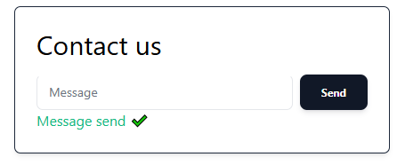

# Discord contact form

Simple contact form web widget that sends messages to a Discord server via webhook.

 


Built using PHP, [Tailwind](https://tailwindcss.com/) and [HTMX](https://htmx.org/)

I made this a while back to learn how to integrate Tailwind with PHP. Now I dockerized to learn [Docker](https://www.docker.com/). Also added HTMX JavaScript library for Async message submissions.

## Usage
### Using Docker

1. Make sure you have Docker installed on your System. For Windows you can use [Docker Desktop](https://www.docker.com/products/docker-desktop/).

2. Clone this repository

   `git clone https://github.com/markokroselj/discord-contact-form.git`

3. In your Discord server create a new webhook or you can use an existing one. Under Server settings -> Intigrations -> Webhooks.

4. In the root of this repository create `.env` file. Inside put your discord webhook.
    ```
    webhook="webhook"
    ```
5. Open terminal in the root of this repo and run `docker compose up`. Docker will pull the image and run the container with the contact form. To open it go to http://localhost.

    if you are already using port `80`, you can change it in `compose.yml` file under `ports`. Chnage the left value. For example, to change it so it runs on port `8080` change it to `8080:80`.

